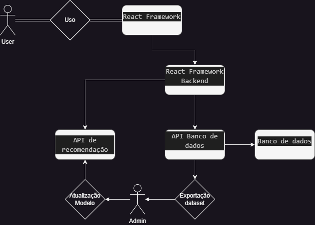

Integrantes:
 - George Lucas Monção Zambonin

## Sistema de recomendação

 Sistema de recomendação com Docker.

#### Containers:

- **Container0**: API de recomendação - Api consumida pelo *Container1*, esta api receberá os conteudos utilizados por um usuario e retornará uma coleção de conteudos que possam estar relacionado com os mesmos.
- **container1**: React Framework - Interface utilizado pelos usuarios do sistema. Um site que mostrará os conteudos relacionados a aqueles que o usuario já possui.

#### Conteudos:
- Recomendação de Livros.

#### Diagrama: 

## How to use:
### Without __Docker__:
 Require __Python__ and __NodeJs__ installed.
 - First download the repo using `git clone https://github.com/glucard/Recommendation-System.git`
 - next `cd Recommendation-System`
 - Then execute the recommendation api:
    - `pip install numpy scikit-learn pandas flask_restful Flask-Cors`
    - `python ./model/model.py`
 - And the frontend:
    - `cd react/frontend`
    - `npm i`
    - `npm run start`

### With __Docker__:
Require __Docker__ installed.
- First download the repo using `git clone https://github.com/glucard/Recommendation-System.git`
- Then `cd Recommendation-System`
- and `docker-compose up`